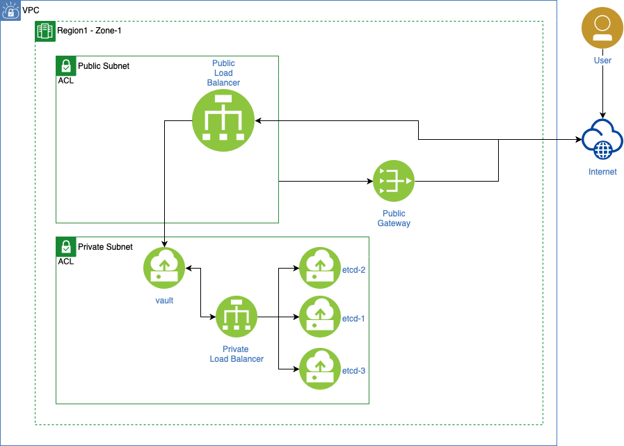
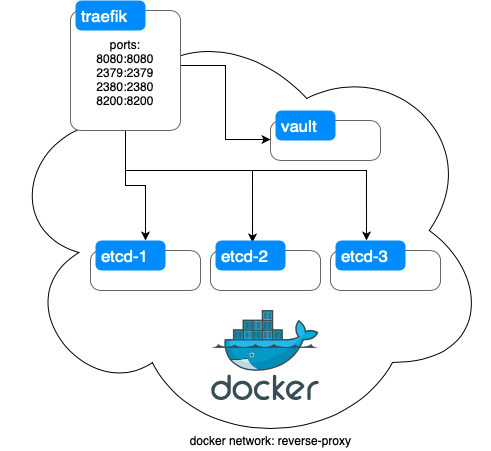

# Vault on Docker Managed by Terraform
Simple Setup for Vault on Docker. The setup will create a cluster of 3 `etcd` nodes to store `vault` data. The cluster is deployed to Oracle Cloud in a private subnet with a public LB. Here is how it will be setup in Cloud:



## Repo Structure

| directory        | Description            | needed for  |
| -------------  |:-------------:| -----:|
| ansible        | playbooks that are used to install docker on cloud instances and deploy etcd and vault | Cloud |
| docker         | docker-compose files for tearfik, etcd and vault |   Local/Cloud |
| docker/**/certs| terraform files to automate generation of certs for etcd and vault |   Local |
| edgeRouter     | not used yet |    - |
| infra          | IaC for creating instances in Oracle Cloud | Cloud |
| media          | pics for README | - |
| scripts        | bash scripts to interact with vault | Local/Cloud |
| vault-main     | terraform files for managing vault | Local/Cloud |


## Local Setup (Demo)
This setup can be used locally for demo purpose as well. For networking in proxying, `tearfik` is used to mimik cloud deployemnt.



## Terraform with Vault
Terraform is used to mainly manage policies and access to Vault itself. It is not used to set and revoke keys. Storing sensitive keys in Terraform is highly discouraged.

# Prerequisite:
* Docker version 19+
* Docker-Compose 1.26+
* Terraform 0.12+
* jq (optional)

# Setup Vault Locally with etcd cluster:
1. `cd docker/reverse-proxy && docker-compose up -d`
2. Create certificates and keys for etcd
    1. `cd docker/etcd/certs`
    2. `terraform init`
    3. `terraform apply -auto-approve`
3. start etcd containers
    1. `cd docker/etcd`
    2. Run the following: `for i in {1..3}; do docker-compose -f docker-compose-node-$i.yml up -d; done`
4. Create certificates and keys for vault:
    1. `cd docker/vault/certs`
    2. `terraform init`
    3. `terraform apply -auto-approve`
4. start vault container:
    1. `cd docker/vault && docker-compose up -d`
5. Add the following to your `/etc/hosts`:
```
127.0.0.1 vault.internal traefik.internal etcd.internal
```
6. You can access vault via `https://vault.internal:8200` and traefik ui via: `http://traefik.internal:8080`

Follow [vault docs](https://www.vaultproject.io/docs) on how to operate vault.


# Setup Vault in the Cloud with etcd cluster:
TBW

Todos:

- [X] Enable TLS
- [X] Use Single dockersied etcd storage
- [X] Enable TLS for etcd
- [X] Create etcd cluster
- [-] ~~Create vault cluster~~ [no longer vaild, will rely on backend cluster - etcd]
- [X] Create policies for vault users
- [ ] Deploy to Oracle Cloud in Private Subnet with LB
